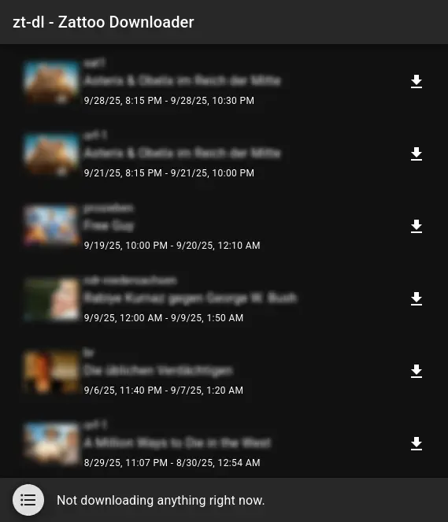

# Zattoo Downloader

A tool to help downloading recordings from Zattoo-offered services. Requires
`ffmpeg` and `ffprobe` underneath. You can get both from [ffmpeg.org](https://ffmpeg.org/).

> [!IMPORTANT]
> Before using `zt-dl` to download recordings, please make sure that this is
> legal in your current location.

> [!IMPORTANT]
> `zt-dl` requires `ffmpeg` and `ffprobe` in your system's `PATH`.

# Usage

For most users the easiest way to use `zt-dl` is probably to use the `interactive`
command, which starts a local web server and offers an easy-to-se interactive
user interface in your browser. This can be done by running:

```sh
./zt-dl interactive --email email-address-you-use-with-zattoo@your-domain.com
```

This will give you an experience similar to the following:



### Advanced usage

For users more familiar with command line interfaces, there are additional
commands that can be used.

| Command | Purpose |
|---|---|
| `list` | Lists recordings currently fully available in your Zattoo account. |
| `download` | Downloads a recording from your Zatto account recording library. |
| `completion` | Generate autocompletion script for various shells. |
| `help` | Help about `zt-dl`. |
