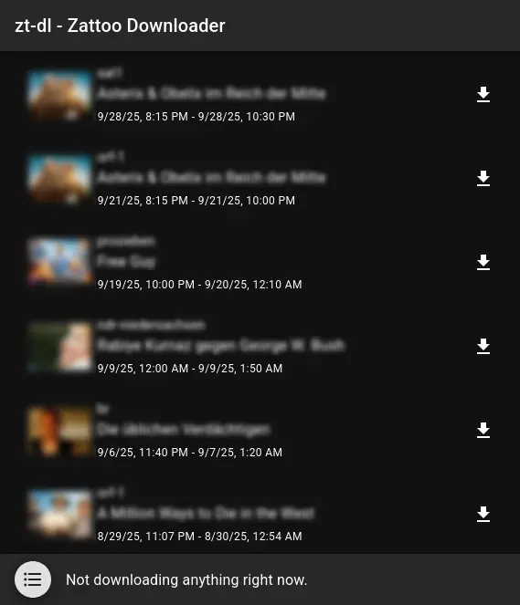
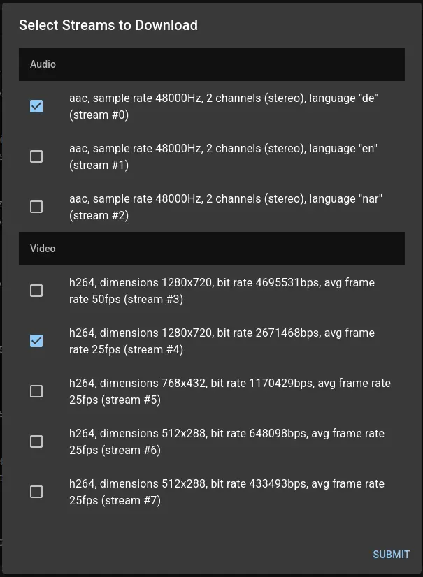

# Zattoo Downloader

A tool to help downloading recordings from Zattoo-offered services. Requires
`ffmpeg` and `ffprobe` underneath. You can get both from [ffmpeg.org](https://ffmpeg.org/).

> [!IMPORTANT]
> Before using `zt-dl` to download recordings, please make sure that this is
> legal in your current location.

> [!IMPORTANT]
> `zt-dl` requires `ffmpeg` and `ffprobe` in your system's `PATH`.

## Usage

For most users the easiest way to use `zt-dl` is probably to use the `interactive`
command, which starts a local web server and offers an easy-to-se interactive
user interface in your browser. This can be done by running:

```sh
./zt-dl interactive --email email-address-you-use-with-zattoo@your-domain.com
```

This will give you an experience similar to the following:



### Advanced usage

For users more familiar with command line interfaces, there are additional
commands that can be used.

| Command | Purpose |
|---|---|
| `list` | Lists recordings currently fully available in your Zattoo account. |
| `download` | Downloads a recording from your Zatto account recording library. |
| `completion` | Generate autocompletion script for various shells. |
| `help` | Help about `zt-dl`. |

### Selection of streams to download

By default, `zt-dl` will select the best audio and video streams to download,
and it will include all subtitle streams that are available.

For audio streams, the best stream is defined as the one with the highest _sample
rate_.
For video streams, the best stream is defined as the one with the highest
_width_, _height_, and _average frame rate_.

Some commands like `interactive` support the flag `--select-streams` (short
form: `-s`) which when specified (or explicitly set to `true`) support a manual
interactive source streams selection. This feature is introduced with version
`0.3.0`, but is not enabled by default for backward compatibility.

When manual source streams selection is configured, the Web UI in the browser
will show a dialoag similar to the following:



### Overwriting target files

By default, `zt-dl` does _not_ overwrite target files. That is, if a file with
the same name already exists, `zt-dl` will fail the download. This behavior can
be changed by specifying the `--overwrite` flag (short form: `-y`) on commands
that download recordings. This feature is introduced with version `0.3.0` but
is not enabled by default for backward compatibility.
